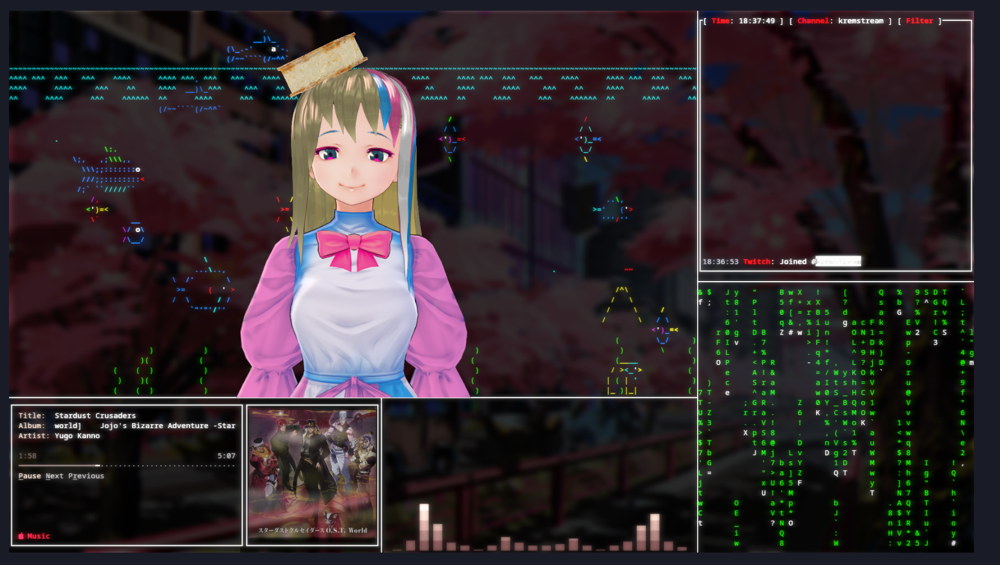

# kremstream

twitch.tv/kremstream setup based on terminal applications

## Intro
This repository contains scripts I use to setup my stream assets in a `kitty` terminal, which is then captured and adjusted in OBS. 

## Dependencies
Core:
- [kitty](https://github.com/kovidgoyal/kitty) terminal configured with `kitty.conf` provided (either adjust yours or copy over)

Kremstream:
- [asciiquarium](https://github.com/cmatsuoka/asciiquarium)
  - Follow repo instructions or find it in your package manager
- [twitch-tui](https://github.com/Xithrius/twitch-tui)
  - Configured to your liking. Kitty supports images, so I recommend enabling emotes
- [Terminal Music Controller](https://git.gay/rosalina/Terminal-Music-Controller)
- [cava](https://github.com/karlstav/cava)
- [cmatrix](https://github.com/abishekvashok/cmatrix)
- [chafa](https://hpjansson.org/chafa/)
  - Used to play a gif of Blahaj in `symbols` format

## Usage
Basic:
1. Open new Kitty window
2. run `./kitty_stream_init.sh`

To achieve same look in OBS:
1. Add the terminal window as a source
2. Color Correction -> Opacity to ~75% or to your liking
3. [obs-shaderfilter](https://github.com/exeldro/obs-shaderfilter) with a bloom shader

## Notes
Since this has been tested on Linux only (Kubuntu 23.04 on X11 to be exact) I can't assure you it will work the same way on your setup. 